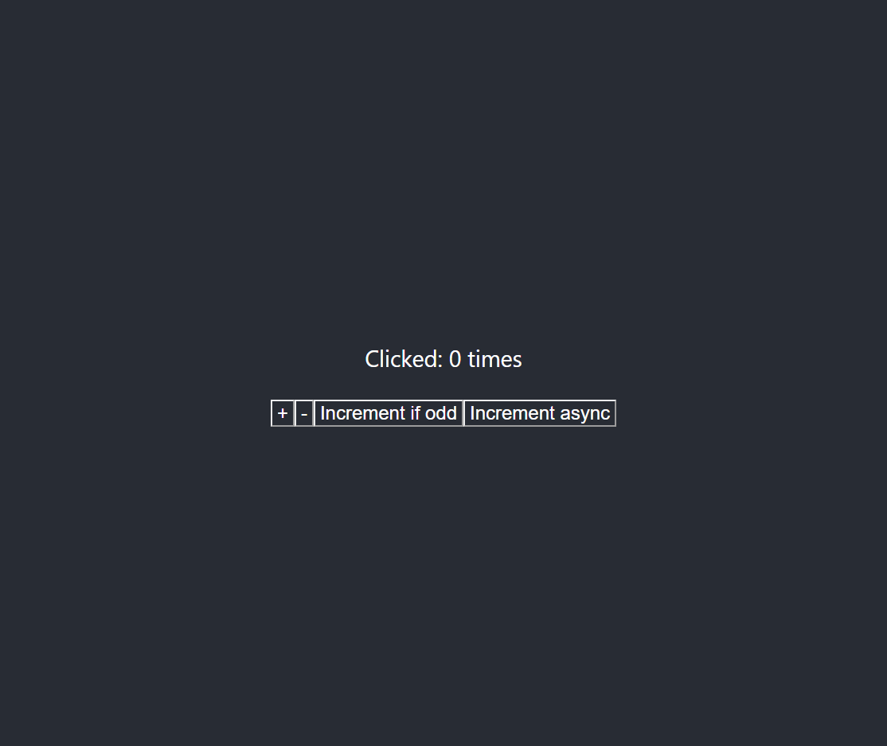
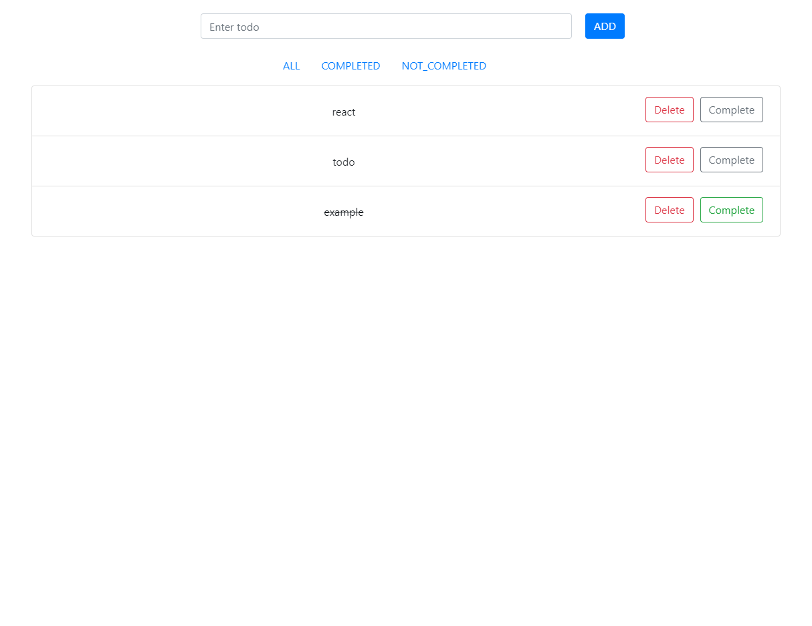

# 📋예제를 통한 Redux 학습⚛

## 📍목록

1. [counter-vanilla](https://github.com/CaesiumY/redux-todo-example/tree/master/counter-vanilla/src): 바닐라 자바스크립트와 리덕스를 사용한 카운터
2. [counter](https://github.com/CaesiumY/redux-todo-example/tree/master/counter): 리액트와 리덕스를 이용한 카운터
3. [todo](https://github.com/CaesiumY/redux-todo-example/tree/master/todo): 리액트 + 리덕스 + 라우터를 활용한 Todo 리스트 예제

### 📷스크린샷

2. counter

3. Todo

[모바일 링크](https://github.com/CaesiumY/redux-todo-example/blob/master/screenshots/react_todo_mobile.png)

